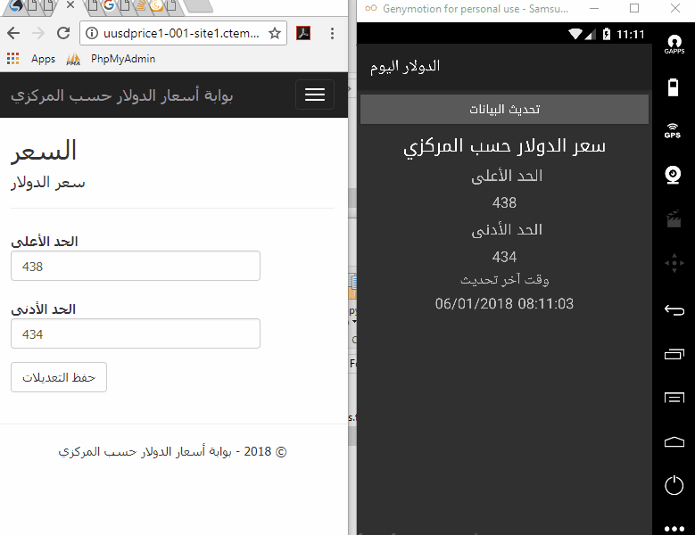

# USD2SYP
 
exchange rate between usd and syrian pounds, using SignalR to watch the changes as they happen. 

# The project
this is my first time to try [SignalR](https://dotnet.microsoft.com/en-us/apps/aspnet/signalr/ "SignalR") Real-time data exchange 
the web server was made using ASP.net MVC and the Client using Xamarine
